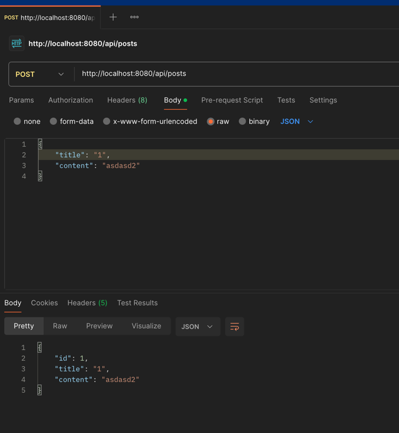
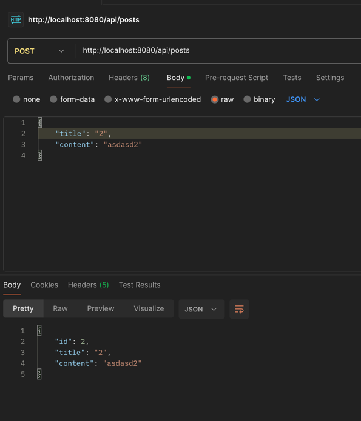
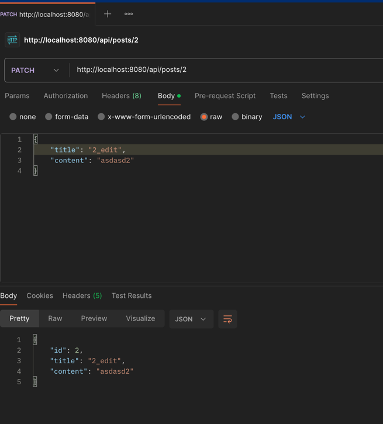
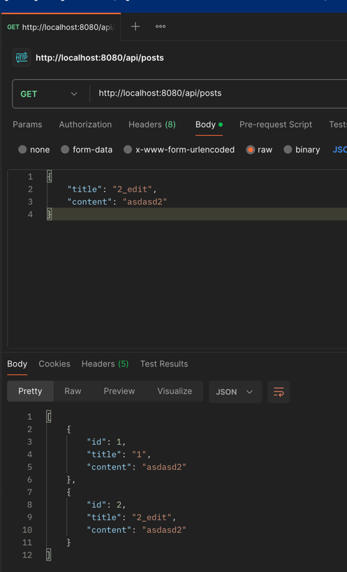
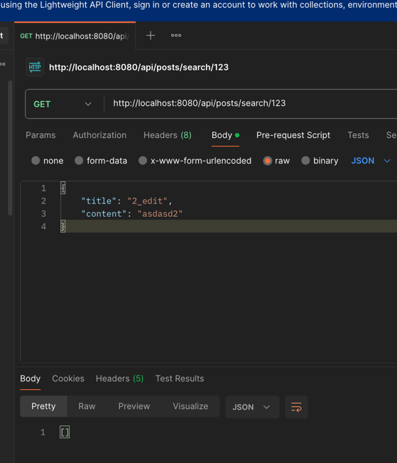
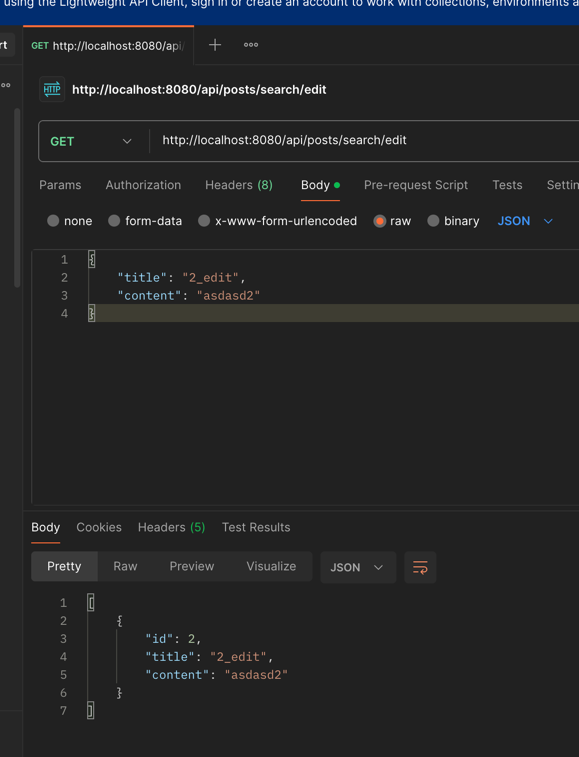
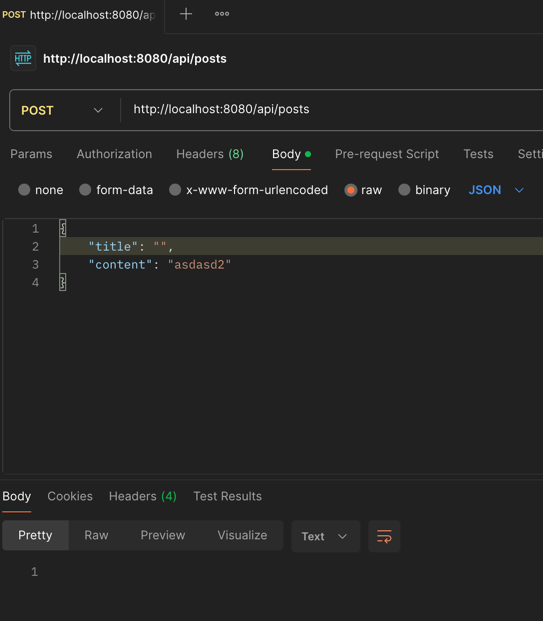
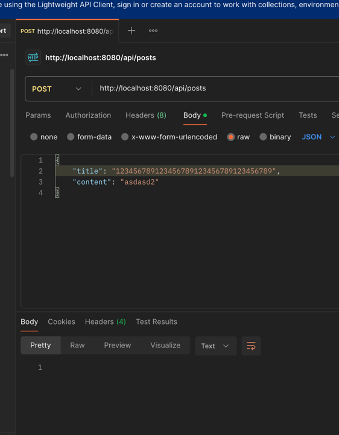

## 구현 기능
- 게시글 등록 / 수정
- 제목 유효성 검사 (비어 있으면 등록 불가, 30자 제한)
- 게시글 리스트 api를 추가 
- 중복된 제목의 게시글은 작성 불가
- 게시글 검색 기능을 추가

## 과제 체크리스트
 - [x] 게시글 수정 api를 추가해주세요.
- [x]  게시글 리스트 api를 추가해주세요.
- [x]   제목이 비어 있는 경우에는 게시글 작성이 되지 않게 해주세요.
- [x]   제목은 30자를 넘지 않게 해주세요.
- [x]   중복된 제목의 게시글은 작성되지 않게 해주세요.
- [x]   게시글 검색 기능을 추가해주세요. (예: 제목 키워드로 검색)

## 실행 결과

## 키워드 과제 정리
SOLID 원칙: 유지보수와 확장이 쉬운 유연한 소프트웨어를 만들기 위한 객체 지향 설계의 다섯 가지 기본 원칙입니다.

Controller, Service, Repository, Domain: 컨트롤러는 사용자 요청을 받고, 서비스는 핵심 비즈니스 로직을 처리하며, 리포지토리는 데이터베이스 접근을 담당하고, 도메인은 핵심 데이터와 비즈니스 규칙을 정의합니다.

RESTful: 자원(Resource)을 중심으로 HTTP 메서드를 통해 그 자원에 대한 행위를 표현하는, 일관성 있는 웹 API 설계 규칙을 따르는 것을 의미합니다.

HTTP 클라이언트와 서버: 클라이언트는 서버에 자원을 요청(Request)하는 역할을 하고, 서버는 그 요청을 받아 처리한 후 응답(Response)하는 역할을 합니다.

자바 레코드(record): 불변(immutable) 데이터를 간단하게 표현하기 위해 사용되는 특별한 종류의 클래스입니다.